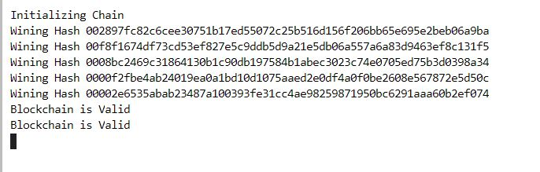
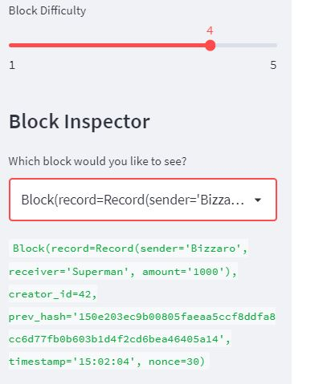
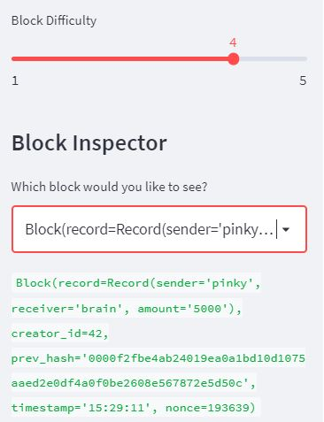
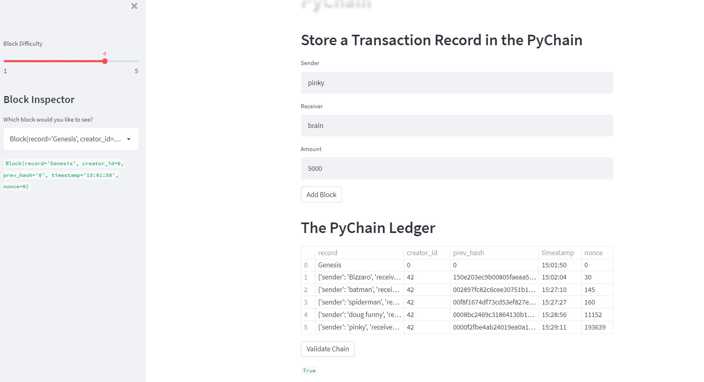

# PyChain Ledger

You’re a fintech engineer who’s working at one of the five largest banks in the world. You were recently promoted to act as the lead developer on their decentralized finance team. Your task is to build a blockchain-based ledger system, complete with a user-friendly web interface. This ledger should allow partner banks to conduct financial transactions (that is, to transfer money between senders and receivers) and to verify the integrity of the data in the ledger.

## Instructions

Open the [`pychain.py` file](Starter_Code/pychain.py) included in the Homework's `Starter_code` folder. 

5. Test the blockchain validation process by using the web interface. Take a screenshot of the Streamlit application page, which should indicate the validity of the blockchain. Include the screenshot in the `README.md` file for your homework repository.

---
## Submission

You’ll upload the Python file for this assignment to your GitHub repository.

* Make sure to update the `README.md` file to include an explanation of the Steamlit application, a screenshot or video of your deployed Streamlit application, and any other information that’s needed to interact with your project.

* Submit the link to your GitHub project to Bootcamp Spot.

---

© 2021 Trilogy Education Services, a 2U, Inc. brand. All Rights Reserved.
